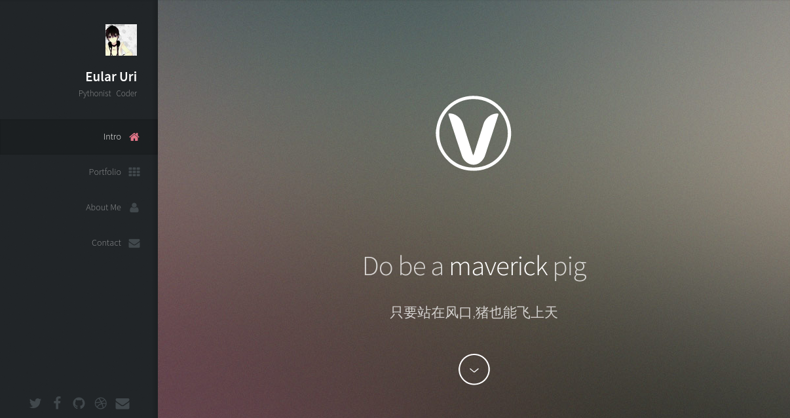
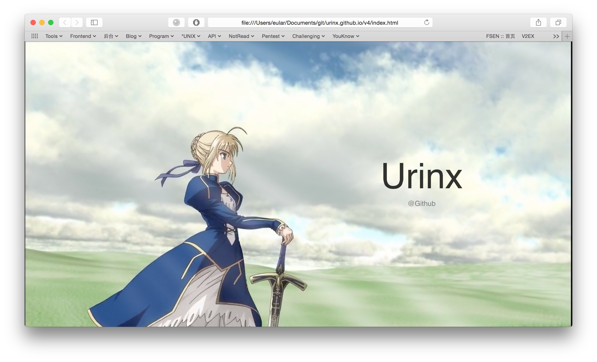
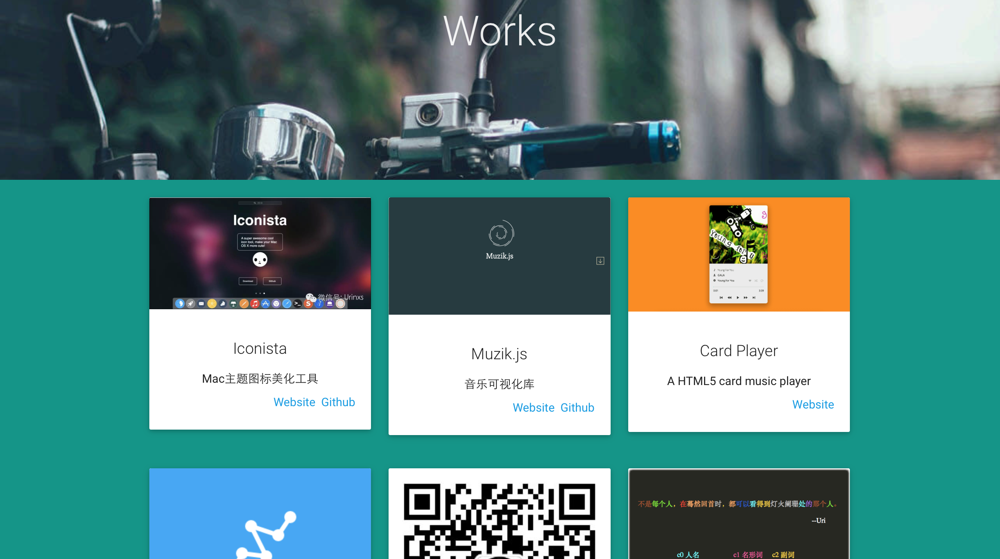
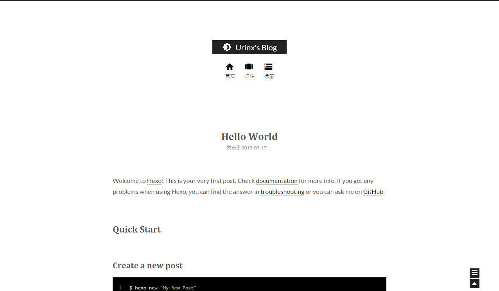
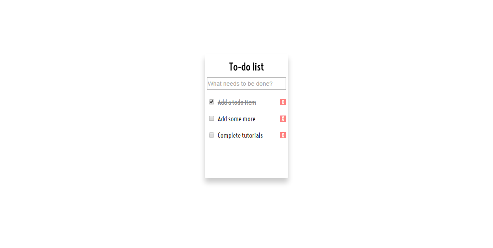
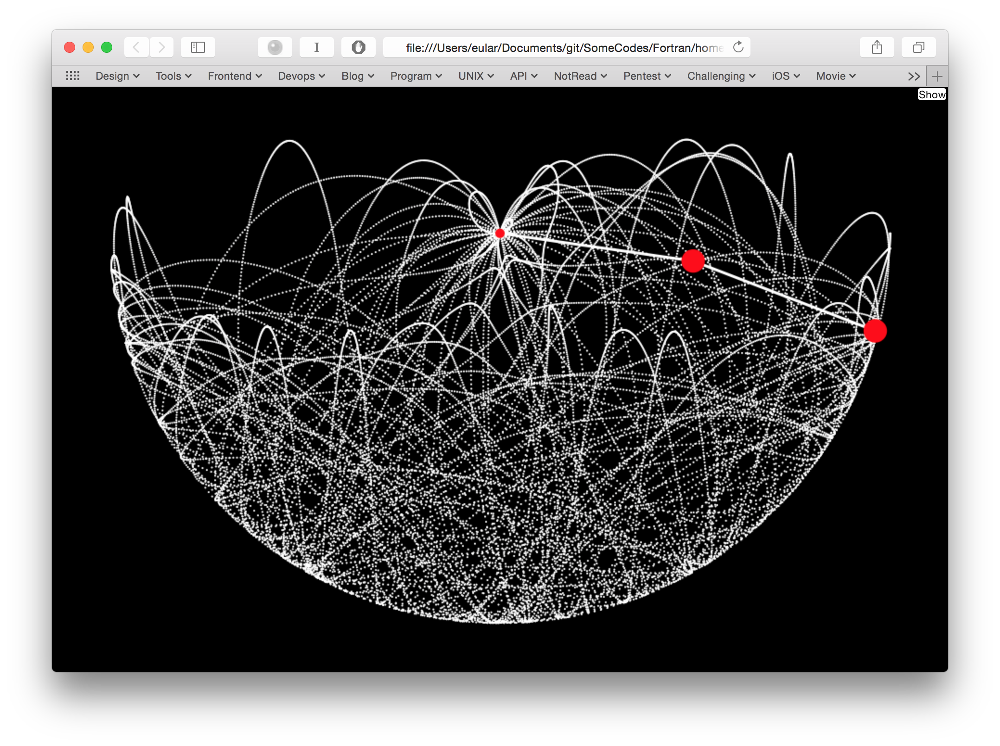
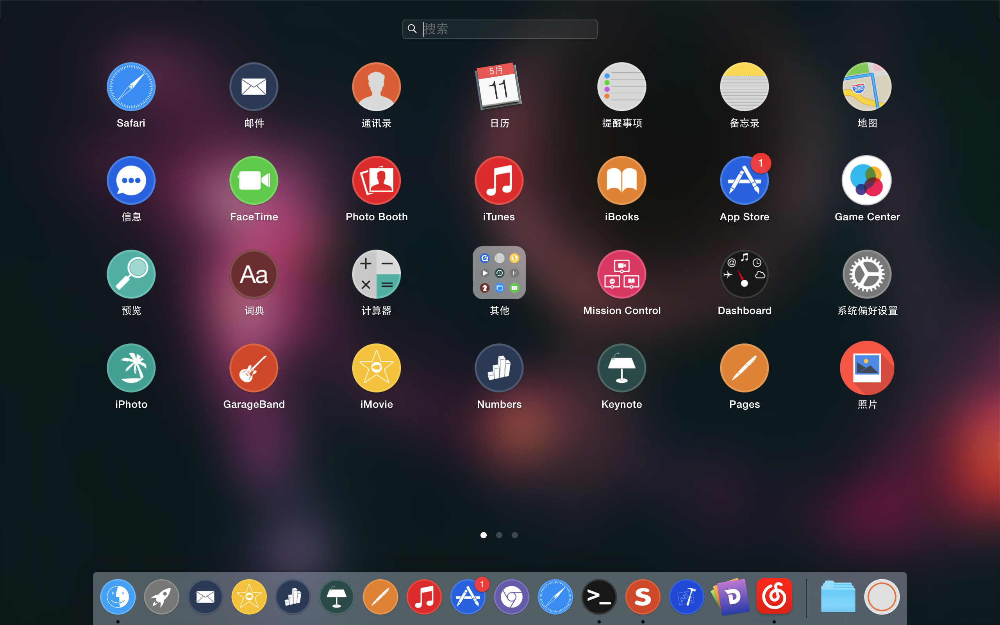
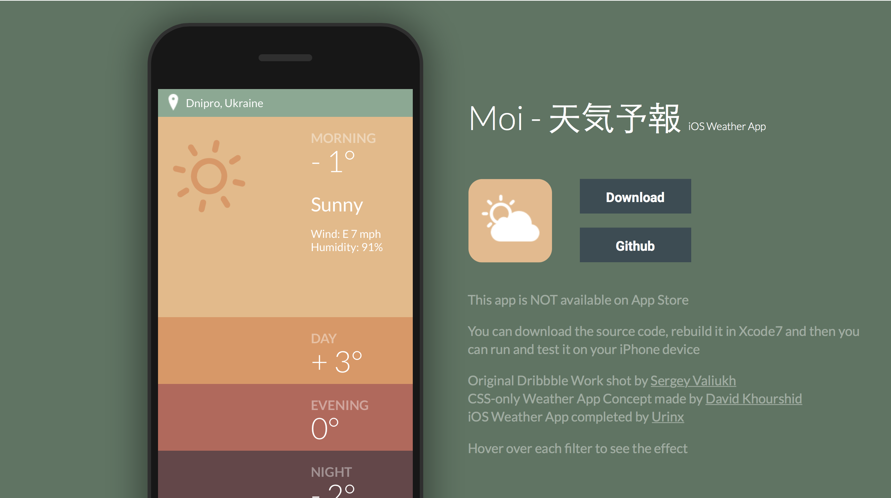

Homepage
========

[Version 1](http://urinx.github.io/v1/)
-----------

[Version 2](http://urinx.github.io/v2/)
-----------

[Version 3](http://urinx.github.io/v3/)
-----------

[Version 4](http://urinx.github.io/v4/)
-----------

[Version 5](http://urinx.github.io/v5/)
-----------

Blog
===

APP
===

[To Do List](http://urinx.github.io/app/to-do-list/)
------------

[Personal Card](http://urinx.github.io/app/personal-card/)
------------

[WeChat](http://urinx.github.io/app/wechat/)
------------

[Muzik.js](http://urinx.github.io/app/muzik-js/)
------------

[Double Pendulum](http://urinx.github.io/app/double-pendulum/)
------------

[Iconista](http://urinx.github.io/app/iconista/)
------------

[Moi - 天気予報](http://urinx.github.io/app/moi/)
------------

